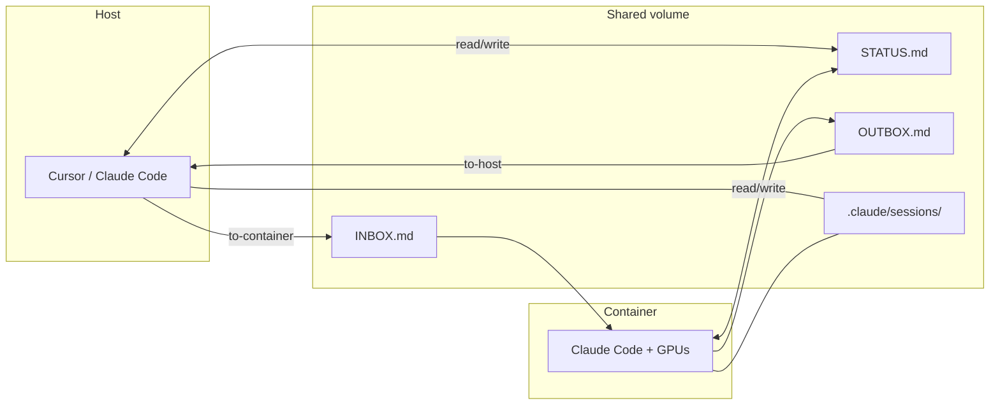

# Cross-container Claude Code bridge

## Problem

GPU work runs in Docker (`run_docker.sh`); planning/discussion may happen on host (Cursor) or phone. Need shared situational awareness without duplicating context.

## Solution: dual layer

1. **File bus** (`memory/bridge/`) — always works with AMD API gateway; async messages + snapshot
2. **Direct exec** (`bridge.sh exec`) — host `docker exec`s into one of *its own* containers (allowlisted by the `/home/yichiche` mount) and runs `claude -p`/`codex exec` headless; the reply prints and is mirrored to `OUTBOX.md`. One-shot, near-real-time, logged to `bridge.log`.
3. **Native RC** (`/remote-control`) — real-time if container uses claude.ai `/login`

Memory convergence is a **separate** concern: session shards already share via the `~/.claude` mount, so `memory/bin/memory-sync.sh` handles it host-locally — the bridge is only for live coordination.

## Docker mounts (already in run_docker.sh)

- `$HOME/.claude:/root/.claude` — session IDs visible on both sides
- `$HOME:/home/yichiche/` — agent-box memory including `remote/`

## Agent ritual

| Side | On start | On task change | On finish |
|---|---|---|---|
| Container | read INBOX, `remote_snapshot.sh --role container` | update `--task` | `remote_msg.sh to-host`, mark INBOX done |
| Host | read STATUS + OUTBOX | `remote_msg.sh to-container` | capture learnings `/memory-capture` |

Related: [[../bridge/README]], skill `/remote-bridge`
